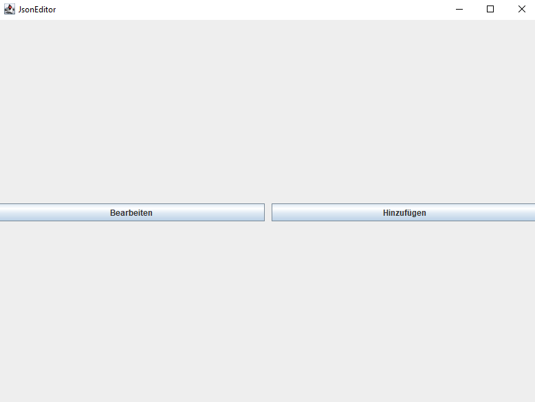
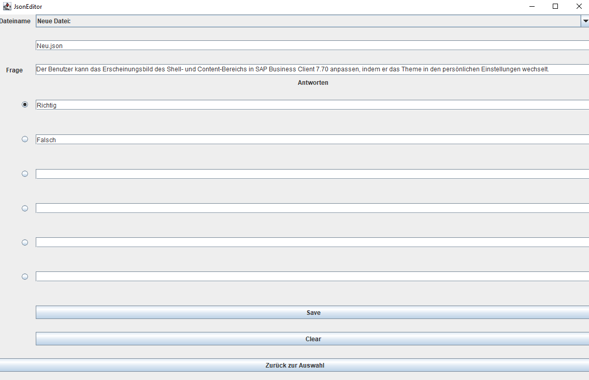
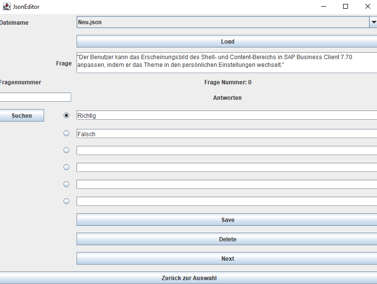

# Json Editor

# About
- Dieser Editor ist zusätzlich zu dem Lernprogramm entstanden, um das Schreiben der Json Dateien
zu erleichtern

# Overview
Nach dem Öffnen des Programms gelangt man ins Hauptmenü:  

  
Hier hat man die Wahl zwischen:  

- Bearbeiten einer existierenden Datei
- Hinzufügen von Fragen zu einer neuen oder existierenden Datei

# Hinzufügen  
  

- Hier hat man die Wahl zwischen einer neuen oder einer existierenden Datei.
- Existierende
Dateien können einfach aus der Combobox ausgewählt werden.
- Bis zu 6 Antworten können maximal gespeichert werden und durch Klicken auf die
Radiobuttons werden die jeweiligen Antworten als korrekt markiert
- Durch "Zurück zur Auswahl" kommt man aus beiden Modi zurück zum Hauptmenü
 

# Bearbeiten  

  

- Im Bearbeitungsmodus können ausschließlich existierende Dateien ausgewählt werden.
- Sobald man eine Datei ausgewählt und auf Load geklickt hat, wird die erste Frage der gewählten Datei geladen
- Nun kann man mit "Next" oder Fragenummern durch die Datei navigieren und nach Belieben bearbeiten oder löschen
